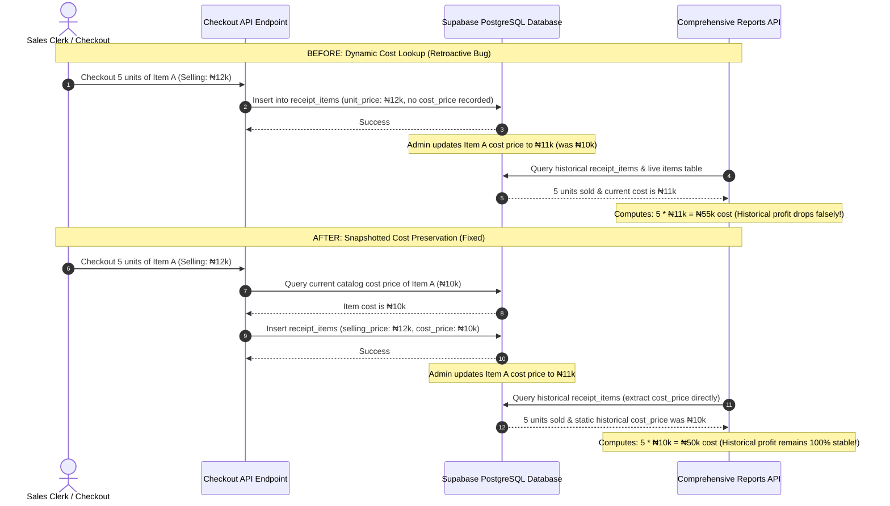

# Executive Architecture Plan: Historical Inventory Cost & Profit Margin Data Integrity

> [!IMPORTANT]
> **Data Integrity Bug Summary:**
> In the current system, when a user updates the purchase/buying cost of an item (`items.unit_price`) in the inventory catalog, that updated price is immediately applied **retroactively** across all past sales when generating report summaries. This recalculates and distorts historical profit and margin totals, corrupting our financial position.

---

## 1. Problem Analysis & Root Cause Diagnosis

### The Database Structure (Current State)
Transactions in our system are recorded using two main entities: `receipts` (main receipt header) and `receipt_items` (individual line items).
- `receipt_items` stores:
  - `unit_price`: The **selling price** paid by the customer at the time of purchase.
  - `quantity`: The count of items sold.
  - `total_price`: The total revenue for that item (`unit_price * quantity`).
- `receipt_items` **does not** store:
  - `cost_price`: The **supply/buying price** (original cost) of the item at the exact second the sale was finalized.

### The Aggregation Pipeline (The Root Cause)
When the Next.js API endpoint ([comprehensive/route.ts](file:///c:/Users/LuckyGold/Desktop/AKV%20-%20Copy/frontend/app/api/admin/reports/comprehensive/route.ts)) generates report aggregates for total profit:
1. It queries the live catalog from the `items` table.
2. It constructs an in-memory `itemCostMap` mapping `item_id -> items.unit_price` (which is the live, current cost price).
3. It iterates over all historical `receipt_items` records and computes:
   $$\text{totalCostPriceSold} = \sum (\text{receipt\_items.quantity} \times \text{live\_item\_cost\_price})$$
4. It derives total profit:
   $$\text{totalProfit} = \text{totalRevenue} - (\text{totalCostPriceSold} + \text{totalExpenses} + \text{totalCommissionPaid})$$

Because step 3 uses the **live catalog** `items.unit_price` value rather than a preserved historical record, changing an item's buying cost in the inventory instantaneously recalculates the cost of goods sold (COGS) for every transaction in that item's history!

---

## 2. Before vs. After Architectural Workflows



---

## 3. Impact Assessment: Affected Dashboards & Tabs

When cost prices update in the catalog, the following UI components are corrupted retroactively due to the lack of historical snapshot values:

| Tab / Component | Affected Path / View | Recalculation Impact |
| :--- | :--- | :--- |
| **Total Profit Card** | `/admin/reports` & `/superadmin/reports` | Summary KPI card displays incorrect total profit figures. |
| **Performance Tab** | `/admin/reports` & `/superadmin/reports` | Detailed staff table miscalculates each clerk's historical Profit/Loss and Profit Margin. |
| **Top Items by Sales** | `/admin/reports` & `/superadmin/reports` (Performance) | Uses live catalog prices to compute revenues. |
| **Sales Analysis Tab** | `/admin/reports` & `/superadmin/reports` | Item list breakdown recalculates the average price and total sales retroactively. |
| **Top Items Sold** | `/admin/reports` & `/superadmin/reports` (Sales) | Re-multiplies historical transaction quantities by live catalog selling prices, distorting revenue trends. |

---

## 4. Phased Implementation Roadmap

To completely eliminate these data integrity bugs and safeguard our financial history, we will execute a 4-phase resolution plan:

### Phase 1: Database Migration & Historical Backfill
We must add a dedicated `cost_price` column to `receipt_items` to record the acquisition price at checkout. In addition, we will apply the same column to `staff_sales` for complete transaction ledger parity.
An instant SQL migration will backfill historical rows using the exact cost price in the inventory at the moment of migration.

### Phase 2: Snapshot Capture at Transaction Checkout
Update both checkout endpoints (Next.js API route and Node.js server service) to query the current cost price (`items.unit_price`) at the exact second the sale is registered and persist it directly in the new database column.

### Phase 3: Analytical Reports Aggregation Upgrades
Update report calculation pipelines (Next.js comprehensive route and Node admin services) to fetch and multiply `receipt_items.cost_price` directly, bypassing the live catalog cost map.

### Phase 4: Selling Price Retroactivity Fix
Update report item-wise groupings to accumulate the actual unit price (`ri.unit_price` or `ri.total_price`) saved in the database during checkout, completely eliminating live catalog selling price lookup recalculations.

---

## 5. Detailed Code Walkthroughs & Diffs

### Phase 1: SQL Schema Alterations & Backfill Migrations
Save and run this script in the Supabase SQL Editor:

```sql
-- 1. Alter receipt_items to support static historical cost price
ALTER TABLE public.receipt_items 
ADD COLUMN IF NOT EXISTS cost_price DECIMAL(10, 2) NOT NULL DEFAULT 0.00;

-- 2. Alter staff_sales for transactional database parity
ALTER TABLE public.staff_sales 
ADD COLUMN IF NOT EXISTS cost_price DECIMAL(10, 2) NOT NULL DEFAULT 0.00;

-- 3. Backfill receipt_items with the best baseline we have (current catalog costs)
UPDATE public.receipt_items ri
SET cost_price = i.unit_price
FROM public.items i
WHERE ri.item_id = i.id;

-- 4. Backfill staff_sales with the current catalog costs
UPDATE public.staff_sales ss
SET cost_price = i.unit_price
FROM public.items i
WHERE ss.item_id = i.id;

-- 5. Add helpful indexes for analytical report performance
CREATE INDEX IF NOT EXISTS idx_receipt_items_cost_price ON public.receipt_items(cost_price);
CREATE INDEX IF NOT EXISTS idx_staff_sales_cost_price ON public.staff_sales(cost_price);

-- 6. Force Supabase schema cache update
NOTIFY pgrst, 'reload schema';
```

---

### Phase 2: Checkout Upgrades (Populate Cost Price)

#### File 1: Next.js API Checkout Route
File Path: `frontend/app/api/receipts/create/route.ts`

```diff
  // Create receipt items
  const itemsToInsert = await Promise.all((items as any[]).map(async (item: any) => {
    let itemName = item.item_name || item.name || '';
+   let costPrice = 0;
+
+   // Query live items catalog to capture cost snapshot (unit_price) at transaction time
+   if (item.item_id) {
+     const { data: dbItem } = await supabaseAdmin
+       .from('items')
+       .select('name, unit_price')
+       .eq('id', item.item_id)
+       .single();
+     if (dbItem) {
+       if (!itemName) itemName = dbItem.name;
+       costPrice = dbItem.unit_price || 0;
+     }
+   }
-   if (!itemName && item.item_id) {
-     const { data: dbItem } = await supabaseAdmin.from('items').select('name').eq('id', item.item_id).single();
-     itemName = dbItem?.name || 'Unknown';
-   }
    return {
      receipt_id: receipt.id,
      item_id: item.item_id,
      item_name: itemName,
      quantity: item.quantity,
      unit_price: item.unit_price,
      total_price: item.total_price,
+     cost_price: costPrice,
    };
  }));
```

#### File 2: Node.js Backend Receipts Service
File Path: `backend/src/services/receipts.service.ts`

```diff
  async createReceipt(data: CreateReceiptData) {
    try {
      // Create the main receipt record
      const { data: receipt, error: receiptError } = await supabaseAdmin
        .from('receipts')
        .insert({
          receipt_number: data.receipt_number,
          staff_id: data.staff_id,
          total_amount: data.total_amount,
          payment_method: data.payment_method,
          sold_outside_jalingo: data.sold_outside_jalingo,
          items_count: data.items.length,
        })
        .select()
        .single();

      if (receiptError || !receipt) {
        throw new Error(`Failed to create receipt: ${receiptError?.message}`);
      }

+     // Retrieve current cost price (unit_price) of items in inventory for transactional snapshot
+     const itemIds = data.items.map(item => item.item_id);
+     const { data: dbItems } = await supabaseAdmin
+       .from('items')
+       .select('id, unit_price')
+       .in('id', itemIds);
+     
+     const itemCostMap = new Map<string, number>();
+     (dbItems || []).forEach((item: any) => itemCostMap.set(item.id, item.unit_price || 0));
+
      // Create receipt items
      const itemsToInsert = data.items.map(item => ({
        receipt_id: receipt.id,
        item_id: item.item_id,
        quantity: item.quantity,
        unit_price: item.unit_price,
        total_price: item.total_price,
+       cost_price: itemCostMap.get(item.item_id) || 0,
      }));
```

---

### Phase 3 & 4: Analytics Dashboard Reports Upgrades

#### File 3: Next.js API Comprehensive Reports Route
File Path: `frontend/app/api/admin/reports/comprehensive/route.ts`

This diff does two key things:
1. It swaps the dynamic cost lookup (`itemCostMap`) in favor of direct summation of `ri.cost_price`.
2. It fixes the `itemsSold` grouping so that it doesn't dynamically map prices based on Jalingo geofencing catalog values, and instead uses the static `ri.unit_price` saved directly on the record.

```diff
-   // Cost price map: item_id -> unit_price (purchase/cost price)
-   const itemCostMap = new Map<string, number>();
-   (allItems || []).forEach((item: any) => itemCostMap.set(item.id, item.unit_price || 0));
- 
-   // Total cost price sold = SUM(items.unit_price * receipt_items.quantity) for ALL sales.
-   // receipt_items is the single source of truth: ALL staff types (commission_staff,
-   // non_commission_staff, sales) write to receipts+receipt_items on every checkout.
-   // Using receipt_items.quantity × items.unit_price (cost/purchase price from inventory).
-   const totalCostPriceSold = (receiptItems || []).reduce((sum: number, ri: any) => {
-     const costPrice = itemCostMap.get(ri.item_id) || 0;
-     return sum + costPrice * (ri.quantity || 0);
-   }, 0);
+   // Total cost price sold = SUM(receipt_items.cost_price * receipt_items.quantity) for ALL sales.
+   // Reads the static cost price snapshotted at checkout directly, eliminating retroactivity!
+   const totalCostPriceSold = (receiptItems || []).reduce((sum: number, ri: any) => {
+     const costPrice = ri.cost_price || 0;
+     return sum + costPrice * (ri.quantity || 0);
+   }, 0);

...

    // Group items sold
    const itemsSold = new Map<string, any>();
    (receiptItems || []).forEach((ri: any) => {
      const itemName = ri.items?.name || `Item ${ri.item_id}`;
      if (!itemsSold.has(ri.item_id)) itemsSold.set(ri.item_id, { item_id: ri.item_id, item_name: itemName, quantity_sold: 0, total_revenue: 0 });
      const cur = itemsSold.get(ri.item_id);
      cur.quantity_sold += ri.quantity || 0;
-     const soldOutside = receiptOutsideMap.get(ri.receipt_id) || false;
-     const prices = itemPriceMap.get(ri.item_id);
-     const unitPrice = soldOutside
-       ? (prices?.price_outside || prices?.price_jalingo || ri.unit_price || 0)
-       : (prices?.price_jalingo || ri.unit_price || 0);
-     cur.total_revenue += unitPrice * (ri.quantity || 0);
+     // Fix dynamic selling price retroactivity: use actual unit_price (selling price) saved at checkout!
+     cur.total_revenue += (ri.unit_price || 0) * (ri.quantity || 0);
    });
```

#### File 4: Node.js Backend Reports Service
File Path: `backend/src/services/admin.service.ts`

```diff
      // Group items sold — use actual selling price (price_jalingo / price_outside)
      const itemsSold = new Map<string, any>();
      (receiptItems || []).forEach((receiptItem) => {
        const itemName = receiptItem.items?.name || `Item ${receiptItem.item_id}`;
        if (!itemsSold.has(receiptItem.item_id)) {
          itemsSold.set(receiptItem.item_id, {
            item_id: receiptItem.item_id,
            item_name: itemName,
            quantity_sold: 0,
            total_revenue: 0,
          });
        }
        const current = itemsSold.get(receiptItem.item_id);
        current.quantity_sold += receiptItem.quantity || 0;

-       // Use actual selling price based on whether sold outside Jalingo
-       const soldOutside = receiptOutsideMap.get(receiptItem.receipt_id) || false;
-       const prices = itemPriceMap.get(receiptItem.item_id);
-       const actualUnitPrice = soldOutside
-         ? (prices?.price_outside || prices?.price_jalingo || receiptItem.unit_price || 0)
-         : (prices?.price_jalingo || receiptItem.unit_price || 0);
-       current.total_revenue += actualUnitPrice * (receiptItem.quantity || 0);
+       // Fix dynamic selling price retroactivity: use actual unit_price saved at checkout!
+       current.total_revenue += (receiptItem.unit_price || 0) * (receiptItem.quantity || 0);
      });
```

---

## 6. Rigorous Verification & Testing Protocol

To verify that the dynamic recalculation issue is completely resolved and that past transactions preserve their original financial margins, perform the following verification workflow:

### Step 1: Pre-Change Analytics Baseline
1. Choose an item in the system (e.g., "Item A", ID `550e8400-e29b-41d4-a716-446655440000`) that has historical sales.
2. In the browser, navigate to the `/admin/reports` page and record the current values of:
   - **Total Profit** (e.g., `₦45,000`)
   - **Total Cost Price Sold** (e.g., `₦100,000`)
3. Alternatively, trigger a baseline API request from your command line:
   ```bash
   curl -H "Authorization: Bearer <token>" "http://localhost:3000/api/admin/reports/comprehensive?dateRange=all" > baseline_report.json
   ```

### Step 2: Simulate Cost Price Inventory Catalog Modification
1. Using the inventory manager portal, edit "Item A" and change its buying cost (increase it by `₦2,000` per unit).
2. For example, change `unit_price` from `₦10,000` to `₦12,000`.

### Step 3: Post-Catalog Modification Analytics Audit
1. Navigate back to the `/admin/reports` page or refresh your dashboard view.
2. **Success Condition:**
   - **Total Profit must NOT change.** It must remain exactly `₦45,000`.
   - **Total Cost Price Sold must NOT change.** It must remain exactly `₦100,000`.
3. If you run a diff against your API backups, the results should be identical:
   ```bash
   curl -H "Authorization: Bearer <token>" "http://localhost:3000/api/admin/reports/comprehensive?dateRange=all" > post_update_report.json
   diff baseline_report.json post_update_report.json
   ```
   *The diff utility should return zero changes in historical aggregates.*

### Step 4: Verify Live Checkout capture
1. Run a test sale of 1 unit of Item A (Clerk sells it).
2. Inspect the database record in `receipt_items` for the new transaction:
   ```sql
   SELECT id, item_id, quantity, unit_price, cost_price 
   FROM public.receipt_items 
   ORDER BY created_at DESC 
   LIMIT 1;
   ```
3. **Success Condition:** The `cost_price` column in the database must match `12000.00` (the new snapshot buying price), while older records continue to preserve their `10000.00` original buying costs.

---

## 7. Operational Checklist & Safe Deployment

> [!CAUTION]
> **Deployment Safety Precautions:**
> Always run the SQL schema migration in the database **prior** to pushing the checkout/checkout API backend code updates. If you push the code first, the inserts will fail with a database error because the backend will attempt to write to `cost_price` which does not yet exist!

Follow this order exactly during deployment:
1. **Backup Database:** Execute a backup dump of the database.
2. **Execute SQL Migrations:** Run the migration script in Supabase SQL editor to create the `cost_price` columns and safely backfill historical cost fields.
3. **Redeploy Backend:** Build and push the backend server and Next.js routes.
4. **Flush Cache:** Execute a schema cache reload to ensure Supabase exposes the new fields.
5. **Execute Verification Protocol:** Perform checkout and catalog edits to confirm margin preservation is active.

---
*Architectural Guide Prepared by **Antigravity** (Advanced Agentic Coding Team).*
